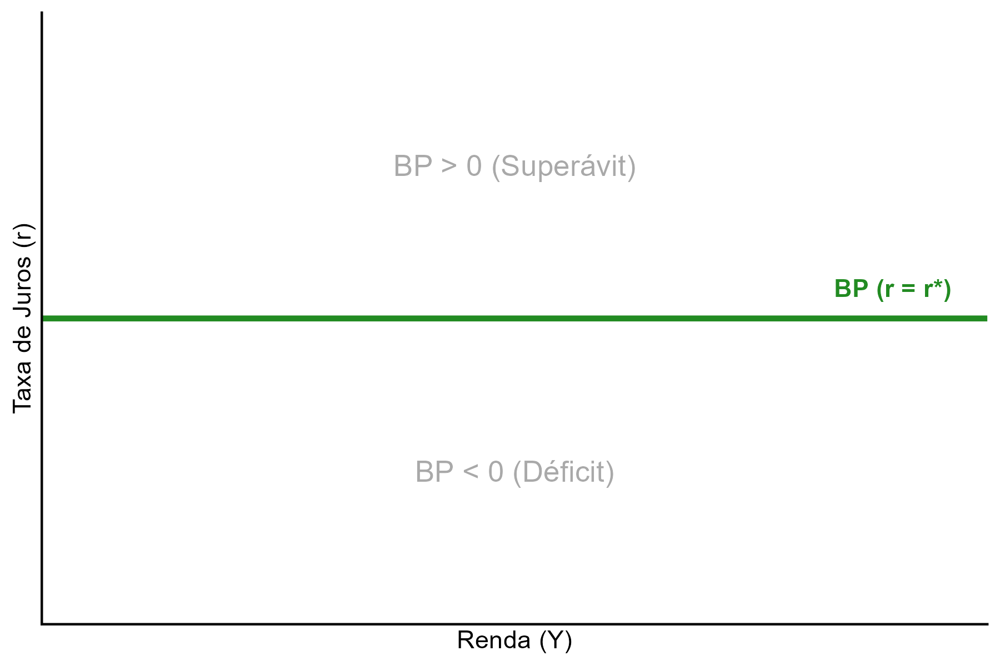
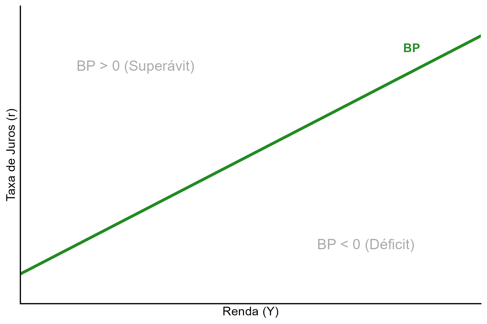
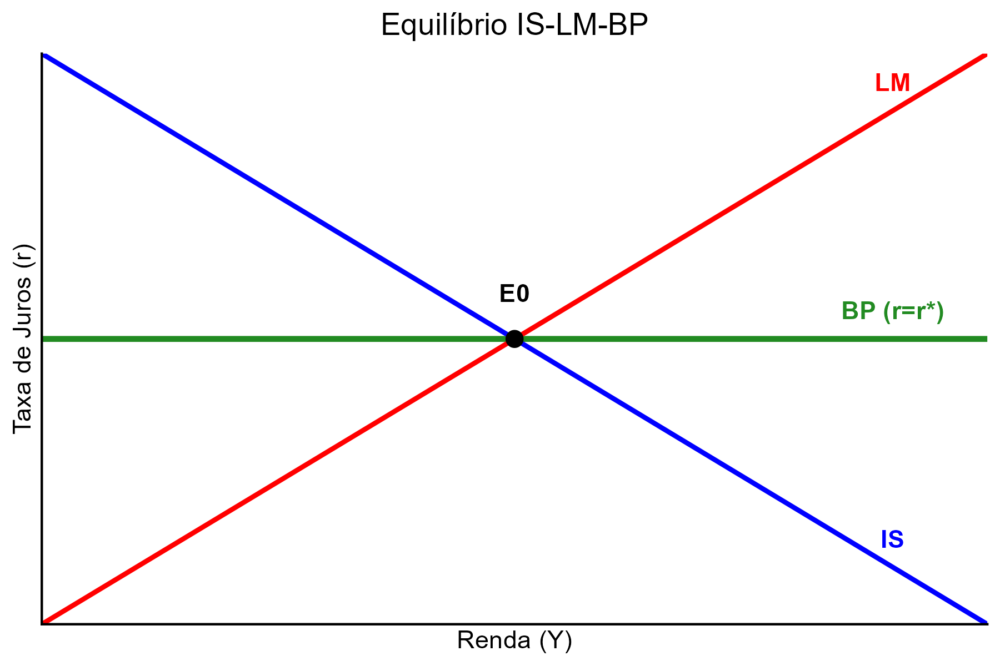
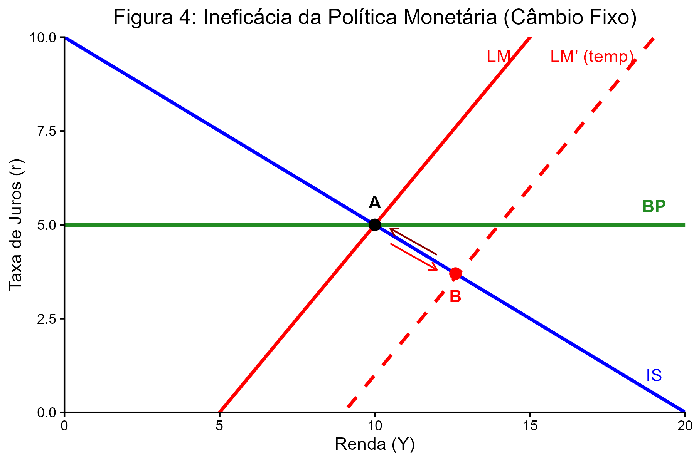
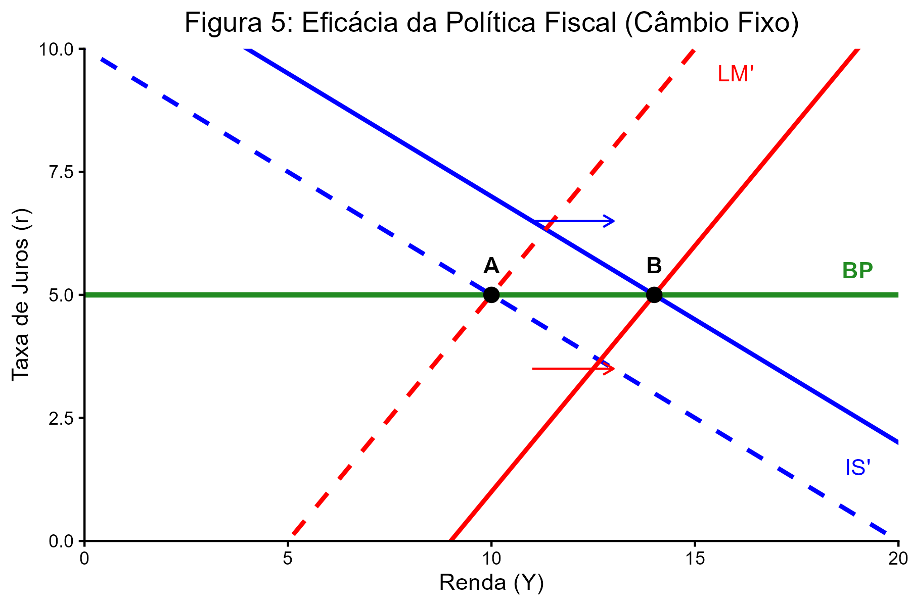
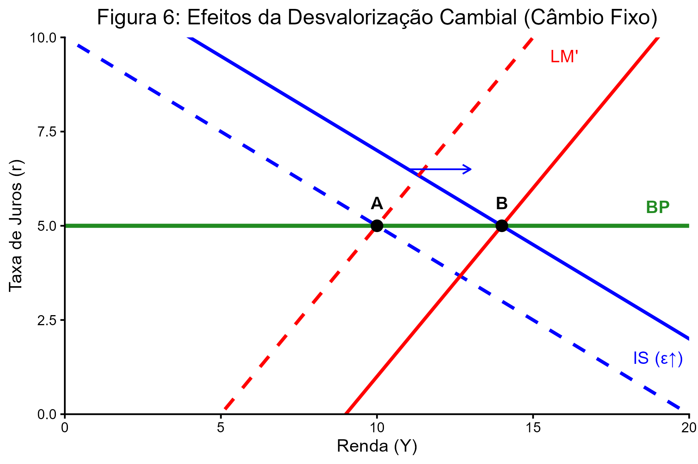
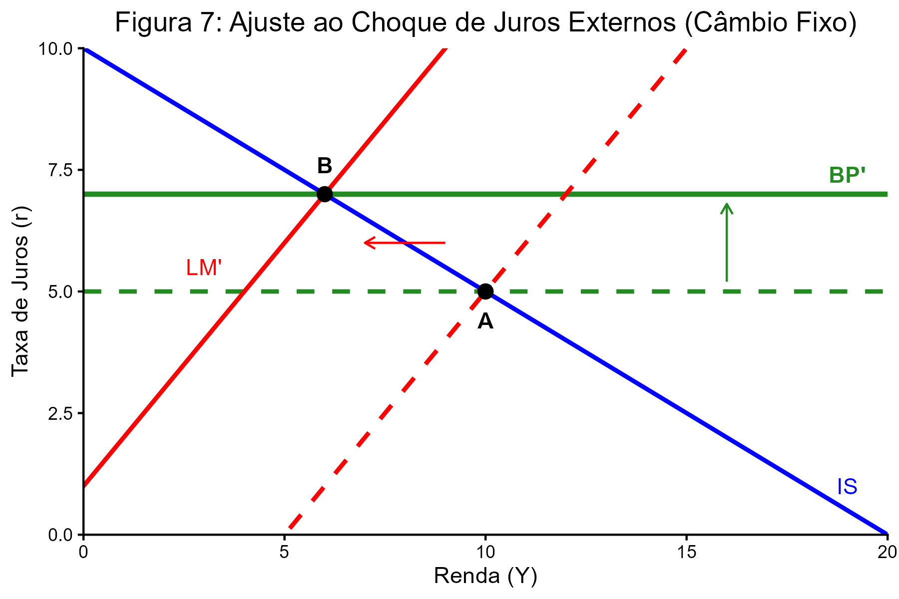
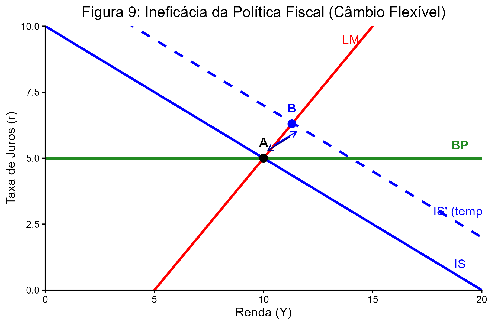
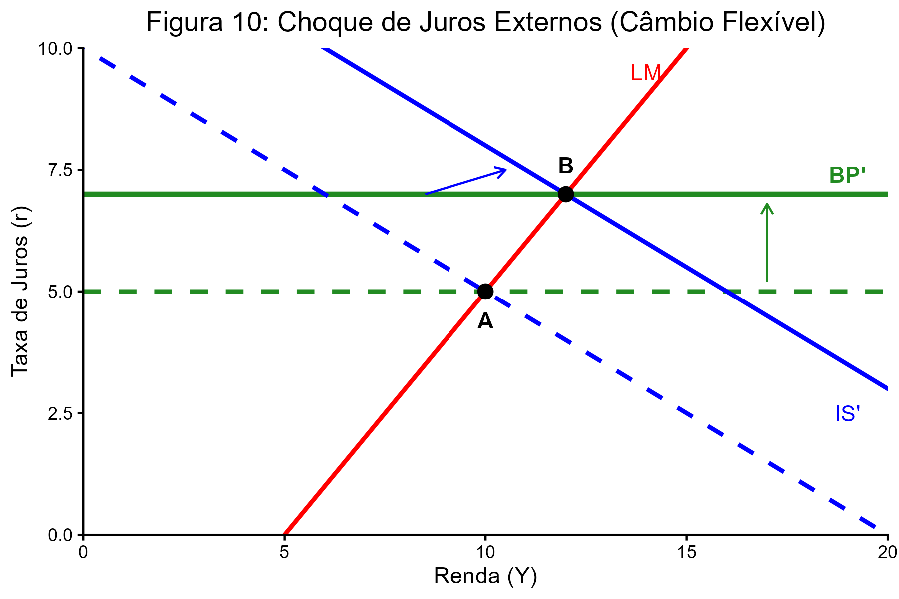

# Notas de Aula: Macroeconomia II – O Modelo IS-LM-BP

## 1. Uma economia aberta no curto prazo

O modelo **IS-LM-BP** estende a análise IS-LM para uma economia aberta no curto prazo. Os seus objetivos fundamentais são:

* **Determinação do Produto:** Analisar como a renda ($Y$) é definida numa economia com fluxos comerciais e financeiros internacionais.
* **Eficácia de Políticas:** Avaliar o impacto das políticas monetária, fiscal e cambial.
* **Transmissão de Choques:** Verificar como impulsos de política económica são transmitidos entre países (transmissão internacional).
* **Premissa Central:** O nível de preços ($P$) assume-se fixo.

---

## 2. O Modelo Matemático

### 2.1. Mercado de Bens e a Curva IS
A curva IS representa o equilíbrio onde o gasto planeado é igual ao produto agregado ($Y$).

* **Equação de Equilíbrio:** $Y = C(Y-T) + I(r) + G + X(\epsilon) - M(\epsilon, Y)$
* **Condição de Marshall-Lerner:** **Assume-se que $(X_{\epsilon} - M_{\epsilon}) > 0$ [^1] para garantir que uma desvalorização cambial aumente o produto nacional**.
* **Equação Diferencial:** $dY = \alpha [dG - C_Y dT + (X_{\epsilon} - M_{\epsilon})d\epsilon + I_r dr]$
* **Multiplicador ($\alpha$):** $\alpha = \frac{1}{1 - C_Y + M_Y}$

> **Intuição:** Um aumento dos gastos públicos ($G$), redução de impostos ($T$) ou depreciação real da moeda ($\epsilon \uparrow$) deslocam a IS para a direita.

### 2.2. Mercado Monetário e a Curva LM
O equilíbrio ocorre quando a oferta real de moeda é igual à procura de moeda ($L$).

* **Equação de Equilíbrio:** $\frac{M}{P} = L(Y, r)$
* **Equação Diferencial (com $dP=0$):** $\frac{dM}{P} = L_Y dY + L_r dr$

### 2.3. O Balanço de Pagamentos e a Curva BP
Representa o equilíbrio externo ($BP=0$), somando a Conta Corrente ($TC$) e a Conta Capital e Financeira ($CF$).

* **Conta Corrente:** $TC = X(\epsilon) - M(\epsilon, Y)$
* **Conta Capital:** $CF = CF(r - r^*)$, onde $CF_{r-r^*} > 0$
* **Equação da Curva:** $dr = -\frac{(X_{\epsilon} - M_{\epsilon})}{CF_{r-r^*}} d\epsilon + dr^* + \frac{M_Y}{CF_{r-r^*}} dY$

#### Graus de Mobilidade de Capitais
1.  **Mobilidade Perfeita ($CF_{r-r^*} \rightarrow \infty$):** A curva BP é uma reta horizontal onde $r = r^*$. Qualquer diferencial de juros gera fluxos infinitos de capital.

2.  **Mobilidade Imperfeita:** A curva BP tem inclinação positiva: $\frac{dr}{dY} = \frac{M_Y}{CF_{r-r^*}}$.

Aqui está o resumo do tópico 2.4, estruturado de forma robusta e sem etiquetas de citação, focando nos mecanismos de ajuste e nos resultados do modelo:

### 2.4 Ajustamento e Transmissão de Choques com Perfeita Mobilidade de Capitais

Este tópico analisa como uma pequena economia aberta reage a políticas e choques externos sob a condição de que o capital se move instantaneamente para onde a taxa de juros é maior. O equilíbrio da Balança de Pagamentos é representado por uma linha horizontal onde a taxa de juros doméstica deve ser igual à internacional ($r = r^*$).

#### 1. Regime de Taxa de Câmbio Fixa
Neste regime, o Banco Central (BC) perde o controle sobre a oferta de moeda, pois precisa intervir no mercado de câmbio para manter a paridade.

* **Política Monetária (Ineficaz):** Uma expansão monetária tenta reduzir os juros, mas a saída massiva de capitais força o BC a vender reservas e recomprar moeda doméstica. A oferta de moeda volta ao nível inicial e o produto não se altera.

****

* **Política Fiscal (Totalmente Eficaz):** O aumento dos gastos públicos pressiona os juros para cima, atraindo capital estrangeiro. Para evitar a valorização da moeda, o BC compra divisas e injeta moeda na economia. A LM se desloca para a direita, acompanhando a IS, resultando em um forte aumento da renda.

* **Desvalorização Cambial:** Ao desvalorizar a moeda propositalmente, o governo torna o produto nacional mais barato para o exterior. Isso desloca a IS para a direita. O ajuste subsequente da LM garante o aumento do produto.

* **Choques Externos ($r^*$):** Se os juros lá fora sobem, o capital sai do país. O BC precisa contrair a base monetária para defender o câmbio, o que desloca a LM para a esquerda, reduzindo a renda interna.

* **Padrão de Transmissão:** Choques fiscais externos (que sobem $r^*$) reduzem o produto doméstico, enquanto choques monetários externos (que também sobem $r^*$ ao reduzir a renda externa) fazem ambos caírem.

#### 2. Regime de Taxa de Câmbio Flexível
Aqui, a oferta de moeda é controlada pelo governo, e o ajuste ao equilíbrio externo ocorre via variações no preço da moeda (taxa de câmbio).

* **Política Monetária (Totalmente Eficaz):** Um aumento de moeda reduz os juros e causa depreciação cambial. Essa depreciação aumenta as exportações líquidas, deslocando a IS para a direita. O produto cresce impulsionado pelo setor externo.

* **Política Fiscal (Ineficaz):** O aumento do gasto público atrai capital e valoriza o câmbio. Essa valorização reduz as exportações líquidas na mesma proporção do gasto público inicial. Ocorre um "crowding-out" externo total: o governo gasta mais, mas as exportações caem, e a renda não muda.

* **Choques Externos ($r^*$):** Um aumento nos juros internacionais causa depreciação imediata da moeda doméstica. Diferente do câmbio fixo, aqui a depreciação é um estímulo: as exportações líquidas sobem, deslocando a IS para a direita e aumentando o produto nacional.

* **Padrão de Transmissão:** Inverte-se a lógica. Choques fiscais no exterior aumentam a renda lá e aqui (transmissão positiva). Choques monetários contracionistas no exterior reduzem a renda lá, mas aumentam a renda aqui via desvalorização cambial (transmissão negativa).

### Síntese de Eficácia (Impacto no Produto $Y$)

| Variável | Câmbio Fixo | Câmbio Flexível |
| :--- | :--- | :--- |
| **Política Monetária** | Ineficaz (Moeda é endógena) | **Eficaz (Via Câmbio)** |
| **Política Fiscal** | **Eficaz (Via Expansão Monetária)** | Ineficaz (Apreciação anula o gasto) |
| **Aumento de $r^*$** | Reduz a Renda ($Y$) | **Aumenta a Renda ($Y$)** |