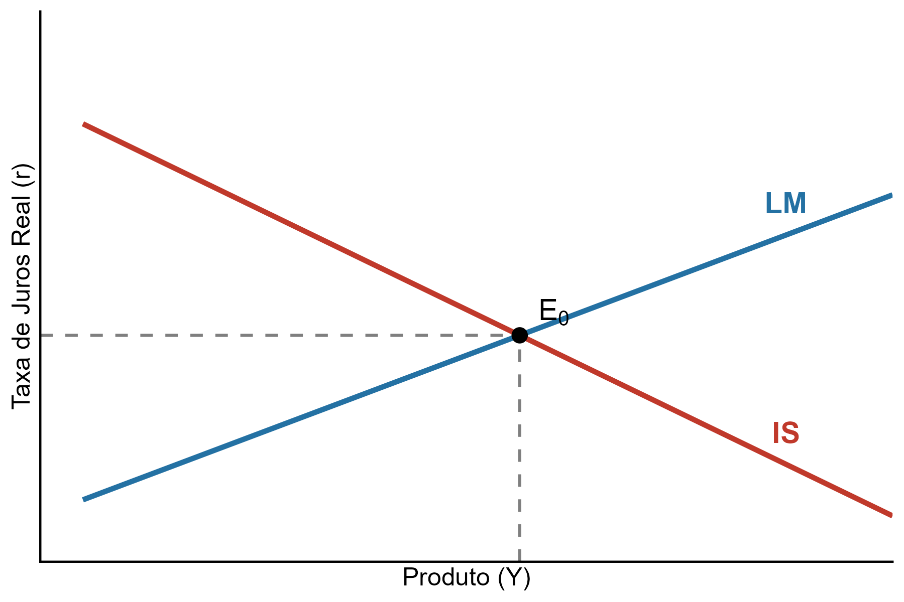
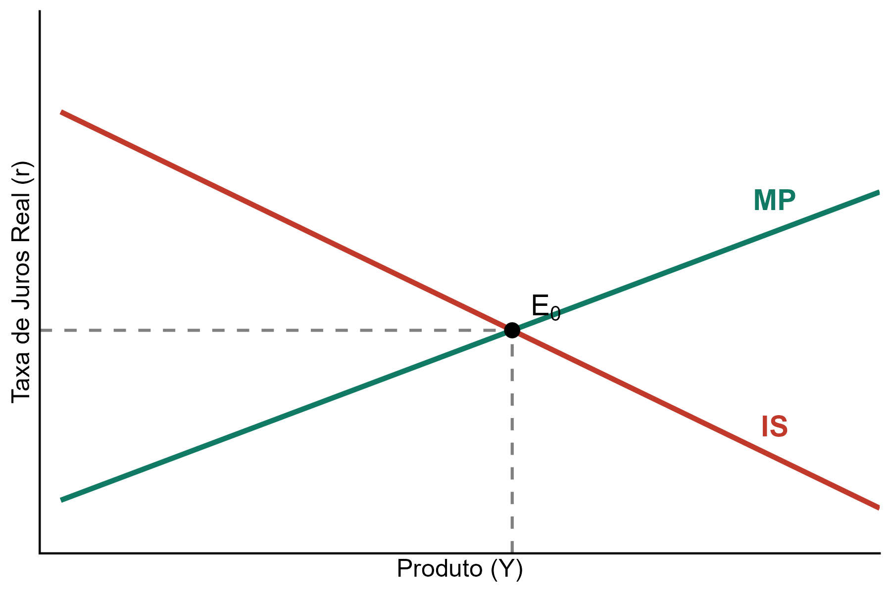
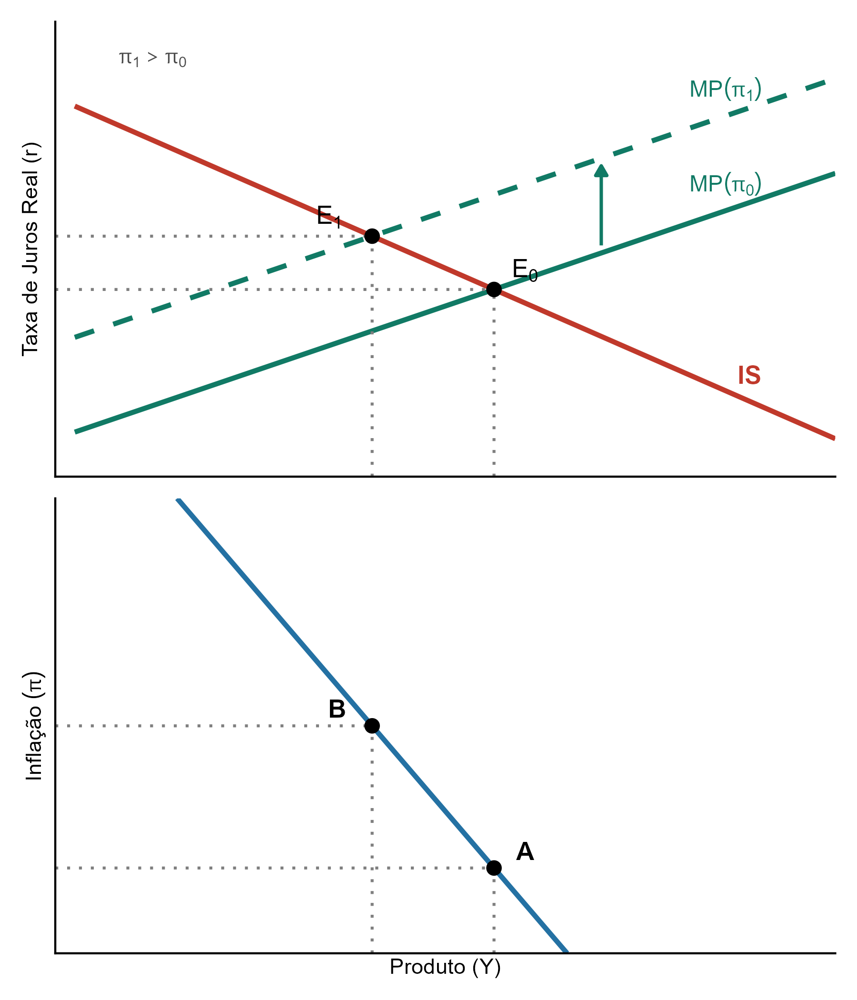
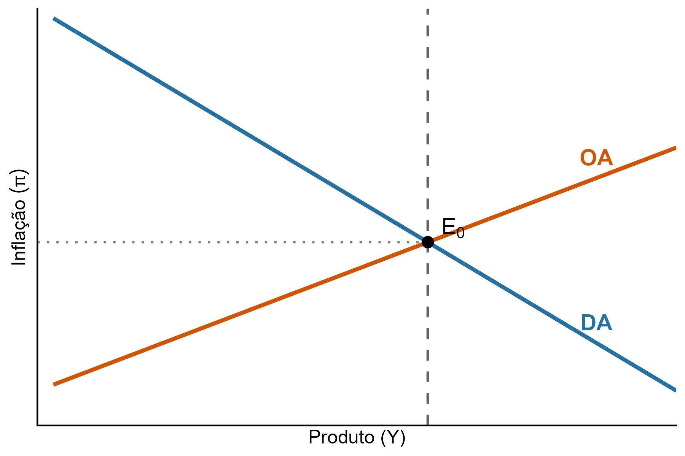

# Notas de Aula: Macroeconomia II – Modelos IS-LM e IS-MP
### Baseado em: Romer, D. *Advanced Macroeconomics*. 4ª ed. McGraw-Hill, 2012.

---

## 1. Introdução: Rigidez Nominal e seus Efeitos

**Rigidez nominal** refere-se a limitações nos ajustamentos de preços e/ou salários nominais. Suas origens incluem custos de menu, contratos de longo prazo e ajustamentos sobrepostos de preços (Calvo pricing).

**Implicação central:** Na presença de rigidez nominal, distúrbios monetários têm **efeitos reais** — o que distingue esses modelos da dicotomia clássica.

Nesta nota apresentamos:
1. O modelo **IS-LM com microfundamentos**, onde a rigidez de preços é exógena.
2. O modelo **IS-MP**, que substitui a LM por uma regra de taxa de juros — mais aderente à prática atual dos bancos centrais.
3. A derivação da **curva de Demanda Agregada (DA)** a partir do IS-MP.

---

## 2. O Modelo IS-LM com Microfundamentos

### 2.1 Suposições

- Preços fixos: $P_t = \bar{P}$ para todo $t$, o que implica $\pi_t = 0$ e $r_t = i_t$.
- Tempo discreto; previsão perfeita (sem incerteza).
- Sem governo, setor externo ou capital.

### 2.2 Tecnologia e Função Objetivo

O produto é dado por:

$$Y = F(L), \quad F'(L) > 0, \quad F''(L) \leq 0 \tag{1}$$

A função objetivo da família representativa é:

$$U = \sum_{t=0}^{\infty} \beta^t \left[ U(C_t) + \Gamma\!\left(\frac{M_t}{P_t}\right) - V(L_t) \right] \tag{2}$$

com $0 < \beta < 1$, $U'(\cdot) > 0$, $U''(\cdot) < 0$, $\Gamma'(\cdot) > 0$, $\Gamma''(\cdot) < 0$, $V'(\cdot) > 0$, $V''(\cdot) > 0$.

As formas funcionais são **CRRA**:

$$U(C_t) = \frac{C_t^{1-\theta}}{1-\theta}, \quad \theta > 0 \tag{3}$$

$$\Gamma\!\left(\frac{M_t}{P_t}\right) = \frac{\left(\frac{M_t}{P_t}\right)^{1-\upsilon}}{1-\upsilon}, \quad \upsilon > 0 \tag{4}$$

> **Intuição:** A moeda entra na função utilidade porque **facilita transações**. Dois ativos disponíveis: moeda ($M$) e títulos ($B$), que rendem taxa nominal de juros $i_t$.

### 2.3 Restrição Orçamentária

Em termos nominais:

$$P_t C_t + B_t + M_t = W_t L_t + (1 + i_{t-1})B_{t-1} + M_{t-1} \tag{5}$$

Em termos reais (dividindo por $P_t$, com $b_t = B_t/P_t$ e $m_t = M_t/P_t$):

$$C_t + b_t + m_t = w_t L_t + \frac{(1+i_{t-1})}{(1+\pi_t)}b_{t-1} + \frac{m_{t-1}}{(1+\pi_t)} \tag{5'}$$

### 2.4 Problema de Otimização

O Lagrangiano é:

$$\ell = \sum_{t=0}^{\infty} \beta^t \left\{ \frac{C_t^{1-\theta}}{1-\theta} + \frac{m_t^{1-\upsilon}}{1-\upsilon} - V(L_t) + \lambda_t \left[ w_t L_t + \frac{(1+i_{t-1})}{(1+\pi_t)}b_{t-1} + \frac{m_{t-1}}{(1+\pi_t)} - C_t - b_t - m_t \right] \right\} \tag{6}$$

As **condições de primeira ordem** são:

$$\frac{\partial \ell}{\partial C_t} = 0 \implies C_t^{-\theta} = \lambda_t \tag{7}$$

$$\frac{\partial \ell}{\partial b_t} = 0 \implies \lambda_t = \beta \lambda_{t+1} \frac{(1+i_t)}{(1+\pi_{t+1})} \tag{8}$$

$$\frac{\partial \ell}{\partial m_t} = 0 \implies m_t^{-\upsilon} = \lambda_t - \beta \frac{\lambda_{t+1}}{(1+\pi_{t+1})} \tag{9}$$

> Se $L$ for variável de controle, acrescenta-se a CPO correspondente.

### 2.5 Derivação da Curva IS

Substituindo $C_{t+1}^{-\theta} = \lambda_{t+1}$, a equação (7) e a equação de Fisher $(1+i_t) = (1+r_t)(1+\pi_{t+1})$ em (8):

$$C_t^{-\theta} = \beta(1+r_t)C_{t+1}^{-\theta} \tag{10}$$

Aplicando logaritmo em ambos os lados e usando $\ln(1+r_t) \approx r_t$:

$$\ln C_t = \ln C_{t+1} - \frac{1}{\theta}\left[r_t - (-\ln\beta)\right] \tag{11}$$

Suprimindo a constante $-\ln\beta$ e usando $Y_t = C_t$ em equilíbrio:

$$\boxed{\ln Y_t = \ln Y_{t+1} - \frac{1}{\theta} r_t} \tag{12}$$

Esta é a **Curva IS Novo-Keynesiana** (sem incerteza): o produto corrente é negativamente relacionado com a taxa de juros real e positivamente com o produto esperado futuro.

> **Intuição:** A família suaviza consumo intertemporalmente. Uma taxa de juros real mais alta torna o futuro relativamente mais atrativo, reduzindo o consumo e o produto hoje.

### 2.6 Derivação da Curva LM

De (8), temos $\beta\lambda_{t+1} = \frac{(1+\pi_{t+1})}{(1+i_t)}\lambda_t$. Substituindo em (9):

$$m_t^{-\upsilon} = \lambda_t\left(\frac{i_t}{1+i_t}\right) = C_t^{-\theta}\left(\frac{i_t}{1+i_t}\right)$$

Invertendo e usando $Y_t = C_t$:

$$m_t = Y_t^{\theta/\upsilon}\left(\frac{1+i_t}{i_t}\right)^{1/\upsilon} \tag{13}$$

A equação (13) mostra que a **demanda real por moeda** é crescente em $Y$ e decrescente em $i$.

Com $P_t = \bar{P}$ (logo $\pi_t = 0$, $r_t = i_t$) e oferta nominal exógena $\bar{M}$, o equilíbrio no mercado monetário é:

$$\boxed{\frac{\bar{M}}{\bar{P}} = Y_t^{\theta/\upsilon}\left(\frac{1+i_t}{i_t}\right)^{1/\upsilon}} \tag{14}$$

Esta é a **Curva LM**: relação positiva entre produto e taxa de juros que equilibra o mercado monetário.

---

<!-- FIGURA 1: Equilíbrio IS-LM no plano (Y, r) -->
<!-- Eixo horizontal: Y (produto); Eixo vertical: r (taxa de juros real) -->
<!-- IS: curva com inclinação negativa -->
<!-- LM: curva com inclinação positiva -->
<!-- Ponto E0: interseção das duas curvas -->

---

## 3. O Modelo IS-MP

### 3.1 Motivação

Bancos centrais modernos não controlam diretamente $M$, mas utilizam a **taxa de juros** como instrumento convencional de política monetária. O modelo IS-MP substitui a LM por uma **regra de política monetária (MP)**.

### 3.2 A Curva MP

O banco central adota a seguinte regra de taxa de juros:

$$r_t = r(\ln Y_t - \ln \bar{Y},\; \pi_t), \quad r_1(\cdot) > 0,\; r_2(\cdot) > 0 \tag{15}$$

onde $\bar{Y}$ é o **produto potencial** (ou taxa natural do produto). A regra (15) mostra uma relação positiva entre $Y_t$ e $r_t$ — denominada **Curva MP**.

O banco central ajusta $M_t$ endogenamente para que:

$$\frac{M_t}{P_t} = Y_t^{\theta/\upsilon}\left(\frac{1+r_t+\pi_t^e}{r_t+\pi_t^e}\right)^{1/\upsilon} \tag{16}$$

produza um $r_t$ que satisfaça (15).

### 3.3 Equilíbrio IS-MP e Derivação da DA

O equilíbrio do modelo IS-MP ocorre na interseção das curvas IS e MP no plano $(Y, r)$.

---

<!-- FIGURA 2: Equilíbrio IS-MP no plano (Y, r) -->
<!-- IS: curva com inclinação negativa -->
<!-- MP: curva com inclinação positiva -->
<!-- Ponto E0: equilíbrio inicial -->

---

**Derivação da Curva DA:** Se a inflação aumenta, a curva MP se desloca para **cima** (o banco central eleva a taxa de juros para conter a inflação). Isso reduz o produto de equilíbrio. A relação negativa entre produto de equilíbrio e inflação é a **Curva de Demanda Agregada (DA)**.

---

<!-- FIGURA 3: Derivação da DA a partir do IS-MP -->
<!-- Painel superior: plano (Y, r) com IS e dois posicionamentos de MP (π baixo e π alto) -->
<!-- Painel inferior: plano (Y, π) com a curva DA resultante — inclinação negativa -->

---

## 4. Oferta Agregada: Trade-off entre Inflação e Produto

### 4.1 Rigidez Salarial Simples

Suponha salários nominais indexados ao nível de preços passado:

$$W_t = AP_{t-1}, \quad A > 0 \tag{17}$$

Com emprego determinado por $F'(L_t) = W_t/P_t$:

$$F'(L_t) = \frac{AP_{t-1}}{P_t} = \frac{A}{1+\pi_t} \tag{18}$$

A equação (18) implica uma **relação positiva entre emprego (produto) e inflação** — um trade-off permanente. 

**Crítica de Friedman (1968) e Phelps (1968):** Não existe trade-off permanente entre $Y$ e $\pi$. A moeda é neutra no longo prazo. O problema com (18) é que os trabalhadores e firmas não aceitarão indefinidamente salários reais mais baixos apenas porque a inflação é mais alta — eles ajustarão expectativas e comportamentos.

### 4.2 Curva de Phillips Aumentada

Uma formulação mais rica para o lado da oferta:

$$\pi_t = \pi_t^* + \lambda(\ln Y_t - \ln \bar{Y}_t) + \varepsilon_t^s \tag{19}$$

onde $\pi_t^*$ é o **núcleo de inflação** (inflação observada se o hiato do produto for zero e não houver choques de oferta) e $\varepsilon_t^s$ é o choque de oferta.

**Caso 1 — Núcleo backward-looking** ($\pi_t^* = \pi_{t-1}$):

$$\Delta\pi_t = \lambda(\ln Y_t - \ln \bar{Y}_t) + \varepsilon_t^s \tag{20}$$

Esta é a **Curva de Phillips Aceleracionista**: o trade-off é entre a **variação** da inflação e o hiato do produto. Se policymakers aceitam inflação sempre crescente, podem manter $Y > \bar{Y}$ permanentemente.

> **Limitação:** O núcleo independe das condições econômicas. Se os agentes antecipam a inflação crescente, ajustam comportamentos e o produto retorna ao potencial.

**Caso 2 — Núcleo forward-looking** ($\pi_t^* = \pi_t^e$):

$$\pi_t = \pi_t^e + \lambda(\ln Y_t - \ln \bar{Y}_t) + \varepsilon_t^s \tag{21}$$

Nenhuma política consegue manter permanentemente $Y > \bar{Y}$.

> **Limitação:** Não há suporte empírico robusto para (21) na forma pura.

**Caso 3 — Curva de Phillips Híbrida** (caso intermediário):

$$\pi_t^* = \varphi\pi_t^e + (1-\varphi)\pi_{t-1} \tag{22}$$

$$\boxed{\pi_t = \varphi\pi_t^e + (1-\varphi)\pi_{t-1} + \lambda(\ln Y_t - \ln \bar{Y}_t) + \varepsilon_t^s} \tag{23}$$

O parâmetro $\varphi \in [0,1]$ pondera o componente forward-looking e o backward-looking. Quando $\varphi = 0$, recuperamos (20); quando $\varphi = 1$, recuperamos (21).

---

## 5. O Modelo DA-OA e Efeitos de Choques

### 5.1 Equilíbrio DA-OA

O equilíbrio geral do modelo combina a Curva DA (derivada do IS-MP) com a Curva de Oferta Agregada (Curva de Phillips) no plano $(\ln Y, \pi)$.

---

<!-- FIGURA 4: Equilíbrio DA-OA no plano (Y, π) -->
<!-- DA: curva com inclinação negativa -->
<!-- OA (Curva de Phillips): curva com inclinação positiva -->
<!-- Ponto E0: equilíbrio de longo prazo com Y = Ȳ -->

---

### 5.2 Efeitos de Choques na Curva IS

**Simplificações:** $\ln\bar{Y} = 0$, curva MP linear $r_t = by_t$, $y_t = \ln Y_t$, núcleo = inflação passada.

O modelo simplificado é:

$$\pi_t = \pi_{t-1} + \lambda y_t \tag{24}$$

$$r_t = by_t \tag{25}$$

$$y_t = E_t y_{t+1} - \frac{1}{\theta}r_t + u_t^{IS} \tag{26}$$

$$u_t^{IS} = \rho_{IS} u_{t-1}^{IS} + e_t^{IS}, \quad 0 < \rho_{IS} < 1 \tag{27}$$

Substituindo (25) em (26):

$$y_t = \frac{\theta}{\theta+b}E_t y_{t+1} + \frac{\theta}{\theta+b}u_t^{IS} = \varphi E_t y_{t+1} + \varphi u_t^{IS} \tag{28}$$

onde $\varphi \equiv \frac{\theta}{\theta+b} \in (0,1)$.

**Solução por iteração forward:** Como (28) vale para todo $t$:

$$E_t y_{t+j} = \varphi E_t y_{t+j+1} + \varphi\rho_{IS}^j u_t^{IS} \tag{30}$$

usando a Lei das Expectativas Iteradas e $E_t u_{t+j}^{IS} = \rho_{IS}^j u_t^{IS}$.

Iterando (28) para frente e assumindo que $\lim_{n\to\infty}\varphi^n E_t y_{t+n} = 0$:

$$y_t = \left(\varphi + \varphi^2\rho_{IS} + \varphi^3\rho_{IS}^2 + \cdots\right)u_t^{IS} = \frac{\varphi}{1-\varphi\rho_{IS}}u_t^{IS}$$

Substituindo $\varphi$:

$$\boxed{y_t = \frac{\theta}{\theta + b - \theta\rho_{IS}}\, u_t^{IS}} \tag{32}$$

**Interpretações de (32):**

- **Maior $b$** (regra MP mais reativa ao produto) → denominador maior → **menor efeito** do choque IS sobre o produto. O banco central amorte o impulso elevando os juros.
- **Maior $\rho_{IS}$** (choque mais persistente) → denominador menor → **maior efeito** do choque IS. O comportamento forward-looking na IS amplifica o impulso: agentes antecipam produto mais alto no futuro e aumentam consumo hoje.

Substituindo (32) em (24):

$$\pi_t = \pi_{t-1} + \frac{\lambda\theta}{\theta + b - \theta\rho_{IS}}\, u_t^{IS} \tag{33}$$

Se os choques na IS são positivamente correlacionados ($\rho_{IS} > 0$), a inflação também se acumula — e **não há força estabilizadora**, pois a regra MP (25) não responde à inflação diretamente.

> **Implicação de política:** Uma regra de Taylor completa — que responde tanto ao hiato do produto quanto à inflação — é necessária para estabilizar $\pi$ diante de choques persistentes na IS.

---

## 6. Síntese dos Modelos

| Característica | IS-LM | IS-MP |
|:---|:---|:---|
| Instrumento de política | Oferta de moeda ($\bar{M}$) | Taxa de juros ($r_t$) |
| Curva de equilíbrio monetário | LM (endógena) | MP (regra exógena do BC) |
| Aderência à prática atual | Menor | Maior |
| Permite derivar DA? | Não diretamente | Sim (variando $\pi$) |
| Rigidez nominal | Preços fixos ($\bar{P}$) | Preços fixos + Curva de Phillips |

> **Mensagem central:** O modelo IS-MP com Curva de Phillips híbrida (23) é o núcleo dos modelos Novo-Keynesianos de médio prazo. Ele combina: (i) demanda determinada pelo comportamento intertemporal das famílias (IS); (ii) política monetária via regra de juros (MP); e (iii) oferta com rigidez nominal e expectativas (Curva de Phillips). O multiplicador de choques da IS depende crucialmente dos parâmetros da regra MP ($b$) e da persistência do choque ($\rho_{IS}$).